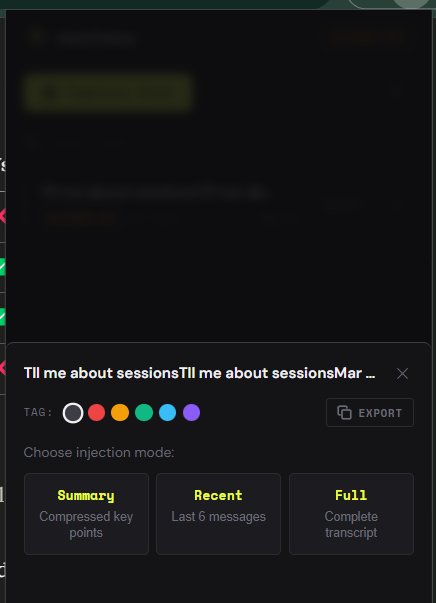

# Nucleus — Chrome Web Store Listing

---

## Name
Nucleus

## Short Description (132 chars max)
Capture AI chat context locally and inject it into any AI tab. Works with Claude, ChatGPT & Gemini. Zero servers, zero data leaving your browser.

(131 chars ✓)

---

## Category
Productivity

## Language
English

---

## Long Description

**Nucleus lets you save AI conversations as portable "pills" and inject them into any AI chat — across platforms, across sessions.**

---

**The problem it solves**

AI chats are isolated. Switch from ChatGPT to Claude, start a new session, or move to a different project — and all that hard-won context is gone. You end up re-explaining the same background over and over.

Nucleus fixes that.

---

**How it works**

→ Open any chat on Claude, ChatGPT, or Gemini
→ Click Capture Chat — Nucleus saves the conversation as a local "pill" in under 2 seconds
→ Later, click Inject on any pill to paste it directly into a new chat input — summary, last 6 messages, or the full transcript

Everything happens inside your browser. No accounts. No servers. No data leaves your device — ever.

---

**Features**

• Capture full AI conversations with one click (or Alt+Shift+C)
• Three injection modes: Summary, Recent (last 6 msgs), or Full transcript
• Color-tag pills for easy organization (6 colors)
• Inline rename — click the pencil icon to rename any pill in place
• Export any pill as a [NUCLEUS CONTEXT] block to clipboard
• Storage meter with warnings at 70% and 90%
• Sort by newest or oldest
• Works across Claude, ChatGPT, and Gemini
• Automatic scraper health check — if a platform's selectors break, Nucleus tells you the last working date instead of failing silently

---

**Privacy**

Nucleus stores everything in chrome.storage.local — sandboxed to the extension, never synced, never transmitted. The only network request is an optional CDN fetch to keep platform selectors up to date; it contains zero user data.

Full privacy policy: [link to privacy.html]

---

## Promotional Tile Text (short — for small tiles)
Save AI chat context. Inject it anywhere.

---

## Screenshot Captions (for 1280×800 screenshots)

1. **Main view** — "All your AI conversations, saved locally as pills. Search, sort, and color-tag in seconds."

2. **Inject modal** — "Choose how much context to inject: Summary, Recent messages, or Full transcript."

3. **Onboarding** — "First-time setup takes under 60 seconds — no accounts, no setup, just capture."
4. **Platform detection** — "Nucleus detects Claude, ChatGPT, and Gemini automatically. Capture with one click."

---

## Keywords (for discoverability)
AI context, Claude, ChatGPT, Gemini, prompt management, AI chat history, context injection, productivity, AI tools, conversation capture
